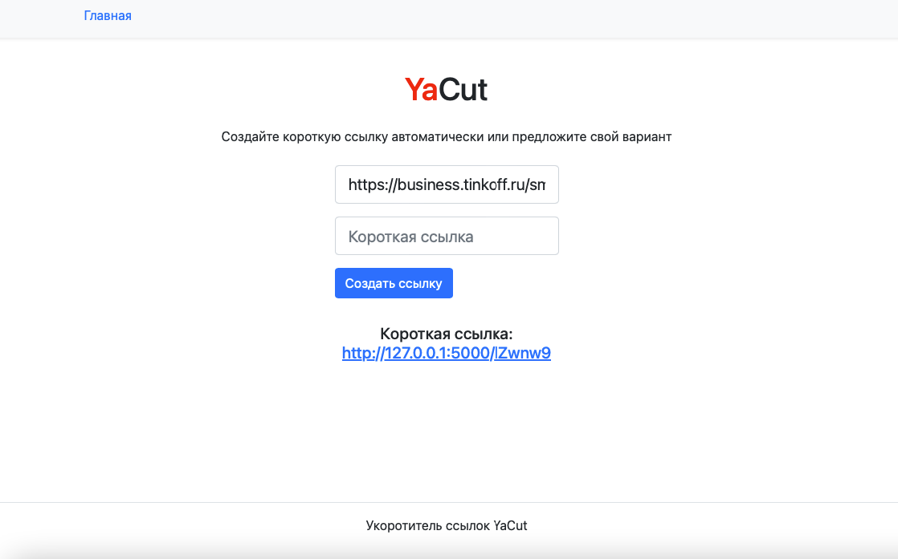

## Проект Cut_on_Flask
### Cut_on_Flask - сервис укорачивания ссылок. Его назначение — ассоциировать длинную пользовательскую ссылку с короткой, которую предлагает сам пользователь или предоставляет сервис.

#### Ключевые возможности сервиса:
 - генерация коротких ссылок и связь их с исходными длинными ссылками,
- переадресация на исходный адрес при обращении к коротким ссылкам.

#### Сервис состоит из пользовательского интерфейса и REST API.

Пользовательский интерфейс сервиса — одна страница с формой. Эта форма состоит из двух полей:
- обязательного для длинной исходной ссылки;
- необязательного для пользовательского варианта короткой ссылки.

Пользовательский вариант короткой ссылки не должен превышать 16 символов.



#### Доступные эндпоинты API:
- api/id/ — POST-запрос на создание новой короткой ссылки;
- api/id/<short_id>/ — GET-запрос на получение оригинальной ссылки по указанному короткому идентификатору.

### Локальный запуск проекта
Клонировать репозиторий и перейти в него в командной строке:

```
git clone git@github.com:isv160179/yacut.git
```

```
cd yacut
```

Cоздать и активировать виртуальное окружение:

```
python3 -m venv venv
```

* Если у вас Linux/macOS

    ```
    source venv/bin/activate
    ```

* Если у вас windows

    ```
    source venv/scripts/activate
    ```

Установить зависимости из файла requirements.txt:

```
python3 -m pip install --upgrade pip
```

```
pip install -r requirements.txt
```

Создать .env файл с переменными окружения:

```
FLASK_APP=yacut
FLASK_ENV=development
DATABASE_URI=sqlite:///db.sqlite3
SECRET_KEY=SECRET_KEY
```
Выполнить миграции:
```
flask db upgrade
```
Запустить сервис на Flask:
```
flask run
```
